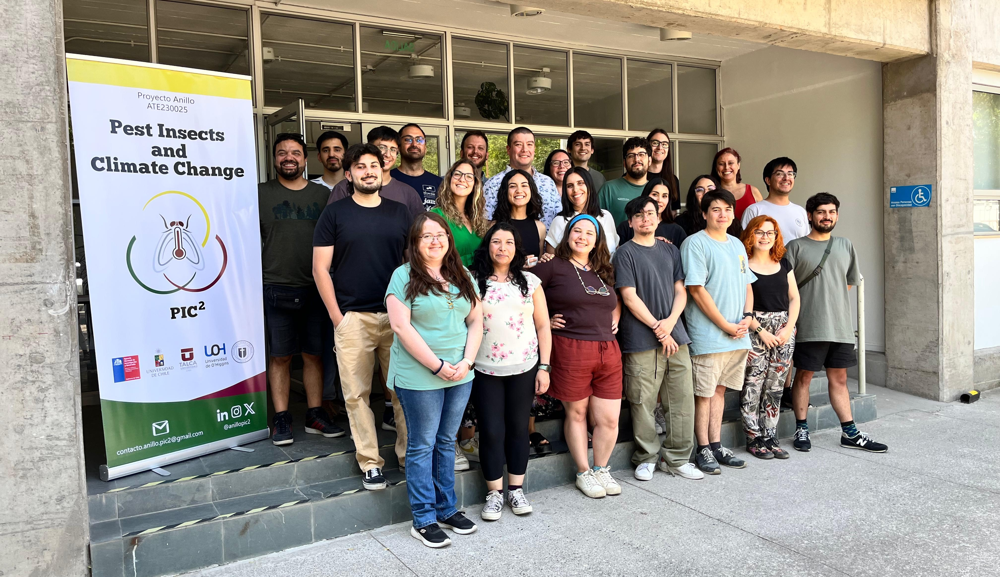
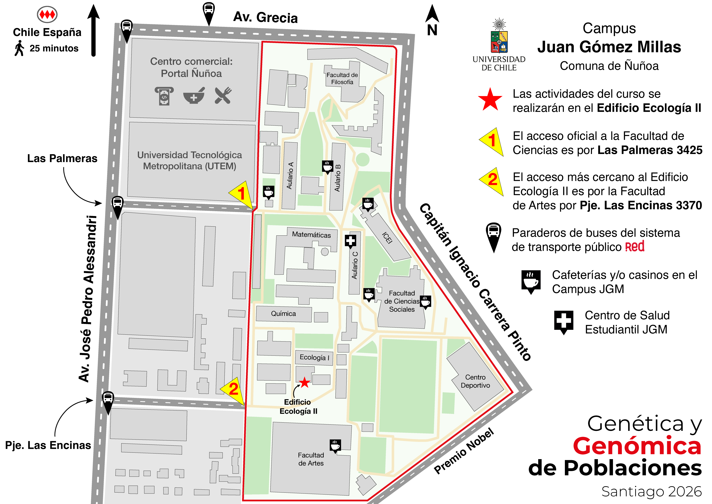

# Genética y Genómica de Poblaciones

## Dr. Moisés A. Valladares, Dra. Pamela Morales, MSc. Paulo S. Zepeda

## Participantes – Enero 2026

Para esta versión del curso fueron seleccionados 22 participantes, a partir de un número elevado de postulaciones recibidas. El grupo final se caracterizó por su diversidad académica, incluyendo estudiantes y jóvenes investigadores/as provenientes de distintas líneas de investigación dentro de la biología evolutiva, genética y genómica.

Los/as participantes pertenecieron a diversas instituciones de Chile, incluyendo (en orden alfabético): PUC, PUCV, UACh, UBB, UChile, UdeC, ULagos, UNAB, USACH, UTal y UV, así como a universidades de Sudamérica, específicamente la UdelaR (Uruguay) y la UFRGS (Brasil).

Esta diversidad institucional y temática enriqueció significativamente las discusiones y el desarrollo del curso.

  

### Fechas: lunes 12 al sábado 17 de enero de 2026 (6 días)
### Horario: 9:30 – 17:30
### Lugar: Sala Alberto Veloso, Facultad de Ciencias, Universidad de Chile
#### Link de [Google Maps](https://maps.app.goo.gl/tbFGmuPNUwphpwpx9) con la ubicación del Campus Juan Gómez Millas.
#### Plano Campus JGM y ubicación de la Sala Alberto Veloso:

  

## Objetivos del curso

El curso tiene como objetivo que las/os participantes adquieran conocimientos teóricos y prácticos en los principales métodos de la genética y genómica de poblaciones, comprendiendo su aplicación en el estudio de procesos evolutivos, ecológicos y de conservación. Está dirigido a estudiantes de pregrado avanzado, postgrado (magíster y doctorado) y personas dedicadas a la investigación en biología, bioinformática y disciplinas afines interesadas en el uso de secuenciación de genomas completos (whole genome sequencing, WGS).

Esta versión del curso pone especial énfasis en aproximaciones aplicadas a la genómica de la invasión, aunque también se abordarán ejemplos de especies nativas. Cada jornada combinará sesiones teóricas y talleres prácticos. Las sesiones prácticas se desarrollarán con el apoyo del Laboratorio Nacional de Computación de Alto Rendimiento ([NLHPC](https://www.nlhpc.cl/)), utilizando el supercomputador Guacolda-Leftraru Epu, que permitirá a las y los participantes ejecutar análisis en un entorno HPC.

## Repositorios del curso

Para el curso hemos dispuesto de dos repositorios donde se alojarán datos, scripts, presentaciones y otros documentos necesarios para las actividades. En este repositorio de **GitHub** estarán disponibles las instrucciones para los talleres y algunos scripts con información necesaria. También tendremos un repositorio en **Dropbox** en el siguiente [link](https://www.dropbox.com/scl/fo/0birdmvdn2qqqvdvd5tf5/AHyhYYfaAAoMIac_ttAd7Kk?rlkey=lsdnpp9q1nuvvke9fhvaa04h9&dl=0) donde subiremos las presentaciones, referencias y otros documentos que usaremos durante el curso. Ambos repositorios se actualizarán constantemente, así que les recomendamos revisarlos cada día. 

Ambos repositorios estarán disponibles por un mes una vez finalizado el curso, tiempo en el que podrán descargar y actualizar los documentos que les sean necesarios. Por último, cabe mencionar que los repositorios fueron diseñados específicamente para las/os asistentes al curso, por ende, les solicitamos no compartir la información y archivos alojados en ellos.

## Agradecimientos

Este curso es financiado por el Proyecto Anillo de Investigación en Insectos Plagas y Cambio Climático ([PIC²](https://www.anillopic2.cl/)) – ANID ATE230025 y patrocinado por la Sociedad Chilena de Evolución ([SOCEVOL](https://www.socevol.cl/)).

